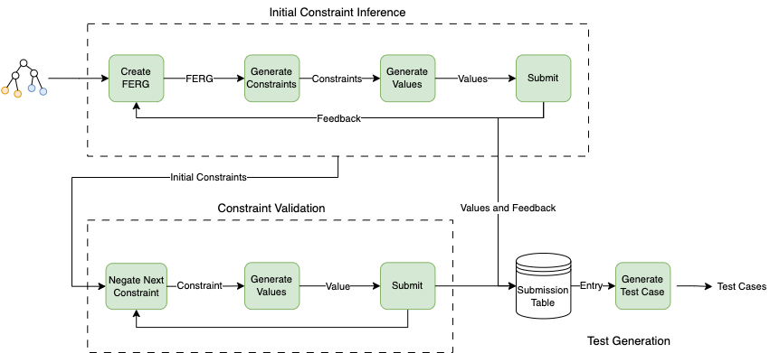

# FormNexus
Source code for "FormNexus: Bridging Semantics and Testing for Web Forms".

## Requirements
Install the requirements with the following command:
```
# with conda
conda install --file requirements.txt
# with pip
pip install -r requirements.txt
```

## Usage
Before running the project, you need to download the [ChromeDriver](https://chromedriver.chromium.org/downloads), and set the executable path in `.env` file with `CHROME_DRIVER_EXECUTABLE` key.

You also need to set the OpenAI API key in `.env` file with `OPENAI_API_KEY` key.

```
# run baseline
python baseline.py

# run Llama 2 workflow
python3 llama.py

# run GPT-4 workflow
python method.py
```

## Dockerized Open-Source Subjects
- [Angular Pet Clinic](https://github.com/dockersamples/spring-petclinic-docker)
- [Saleor](https://github.com/saleor/saleor-platform)
- [Akaunting](https://github.com/akaunting/docker)
- [Invoice Ninja](https://github.com/invoiceninja/dockerfiles)

## FormNexus Workflow


## Constraint Table
| Function Signature | Applicable Input Types | Description | Description in Prompt |
| --- | --- | --- | --- |
| `toBeEqual(value)` | Any | Asserts that the input field value exactly matches the given value | input field should be equal to `value` |
| `toHaveLengthCondition(condition, value)` | Text | Asserts that the length of the input field value matches the given condition | input field's length should be `condition_string` `length` characters |
| `toBeTruthy()` | Any | Asserts that the input field value is truthy (not false, 0, '', null, undefined, or NaN) | input field should be non-empty |
| `toHaveCompareCondition(condition, numberOrDateValue)` | Number, Date | Asserts that the input field value matches the given condition | input field should be `condition_string` `numberOrDateValue` |
| `toContainSubString(subString)` | Text | Asserts that the input field value contains the given substring | input field should contain `subString` substring |
| `toContainChar(charValue)` | Text | Asserts that the input field value contains the given character | input field should contain `charValue` character |
| `toBeAlphabetical()` | Text | Asserts that the input field value contains only alphabetical characters | input field should be alphabetic |
| `toBeNumerical()` | Any | Asserts that the input field value contains only numerical characters | input field should be numeric |
| `toBeAlphaNumerical()` | Text | Asserts that the input field value contains only alphabetical and numerical characters | input field should be alphanumeric |
| `toContainUpperCaseChars()` | Text | Asserts that the input field value contains at least one uppercase character | input field should have uppercase characters |
| `toContainSpecialChars()` | Text | Asserts that the input field value contains at least one special character | input field should have special characters |
| `toContainWhiteSpace()` | Text | Asserts that the input field value contains at least one whitespace character | input field should have whitespace characters |
| `toStartWithString(stringValue)` | Text | Asserts that the input field value starts with the given string | input field should start with `stringValue`
| `toEndWithString(stringValue)` | Text | Asserts that the input field value ends with the given string | input field should end with `stringValue` |
| `freeTextConstraint(constraintStringValue)` | Text | Asserts that the input field value matches the given constraint string | input field should conform to the given condition: `constraintStringValue` |

## Prompts
### Constraint Generation System Prompt
```
Instructions:
Your task is to generate a set of constraints for web form fields. Your decisions must be made independently without seeking user assistance or additional information. If there are multiple ways to express constraints, use the least number of constraints to describe them. Only generate the constraints and refrain from explaining your answers. Only generate constraints for the input field in question, not those in the relevant information section. You must choose your constraints in the format of our modified version of the Jest library in JavaScript. The list of functions in this modified format are:
1. toBeEqual(value) # the input field value is exactly equal to the given value
2. toHaveLengthCondition(condition, value) # the length of the input field value matches the given condition
3. toBeTruthy() # the input field value is truthy and not empty (not false, 0, '', null, undefined, or NaN)
4. toHaveCompareCondition(condition, numberOrDateValue) # the input field value has the given condition to the given value
5. toContainSubString(stringValue)
6. toContainChar(charValue)
7. toBeAlphabetical()
8. toBeNumerical()
9. toBeAlphaNumerical()
10. toContainUpperCaseChars()
11. toContainSpecialChars()
12. toContainWhiteSpace()
13. toStartWithString(stringValue)
14. toEndWithString(stringValue)
15. freeTextConstraint(constraintStringValue) # for constraints that cannot be expressed as a deterministic function from the above functions
16. dummy(relevantField) # add if value of some field could help with filling of this field
You must choose only from this list of functions, and avoid using any other functions. Use the notation "field('elementId')" to refer to input fields in the form. When generating constraints for date-related fields, also take current date into your considerations.

Example of generated constraints for a password input field:
expect(field('password'))
.toHaveLengthCondition('>', 8)
.toHaveLengthCondition('<', 50)
.toBeAlphaNumeric()
.toHaveUpperCase()
.toHaveSpecialChars()
.not.toBeTruthy()
.freeTextConstraint('your password must be a dog\'s name')
.dummy(field('email'))
.toBeEqual(field('confirm-password'))
```

### Value Generation System Prompt
```
Your task is to generate a value for a web form field based on the form field information and a set of constraints on the field.
Your decisions must be made independently without seeking user assistance or additional information.
For each user prompt, you need to generate one value that satisfies the constraints while keeping in mind the nature of the input from the available information.
Only generate value and refrain from explaining your answers.
Only generate value for the input field in question, and not the ones in the relevant information section.
When generating values, generate the ones that actually conform to the constraints, and refrain from altering real-world values to fit the constraint, e.g. do not change the value \"New York\" to \"NewYork\" to satisfy the constraint not to contain whitespace.
```

### User Prompt Structures
The following is the structure of constraint generation user prompt:
```
Today's date: {date_and_time}. When generating constraints for date fields, also generate constraints to compare them with the current date, past, and future if applicable.
We are generating constraints for the following input field:
{local_relation_info}
The relevant input fields available in the form are (in order of relevance):
{global_relation_info}
We have tried the following value in this field before:" if {previously_tried_value}
And got the following inline and global feedback:
{inline_and_global_feedback}
```

and the value generation user prompt:
```
We are generating filling values for the following input field:
{local_relation_info}
The constraints on this input field are:
{constraints}
The values for the fields in constraints are:
{relevant_field_values}
```

## Feedback Filter Keywords
1. invalid
2. valid
3. required
4. error
5. not possible
6. missing
7. failed
8. incorrect
9. retry
10. verify
11. exceeds
12. denied
13. please enter
14. please select
15. format
16. does not match
17. try again
18. unavailable
19. warning
20. out of range
21. unable to
22. not recognized
23. not allowed
24. incomplete
25. cannot process
26. duplicate
27. too short
28. too long
29. doesn't exist
30. does not exist
31. already exist
32. authentication failed
33. expired
34. update failed
35. connection
36. server error
37. system error
38. not valid
39. timed out
40. access denied
41. please confirm
42. not acceptable
43. submission failed
44. unexpected
45. conflict
46. not applicable
47. not active
48. not found
49. not secure
50. forbidden
51. disconnect
52. prohibited
53. cannot
54. can't

## Random and Static Test Rules
You can find these rules in `method/models/random` and `method/models/static` files respectively.